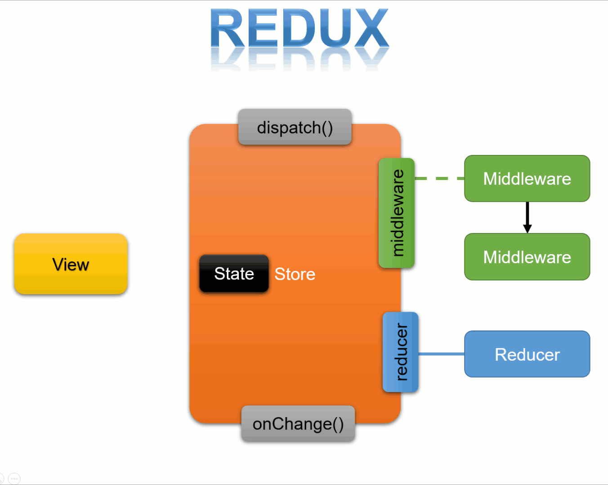
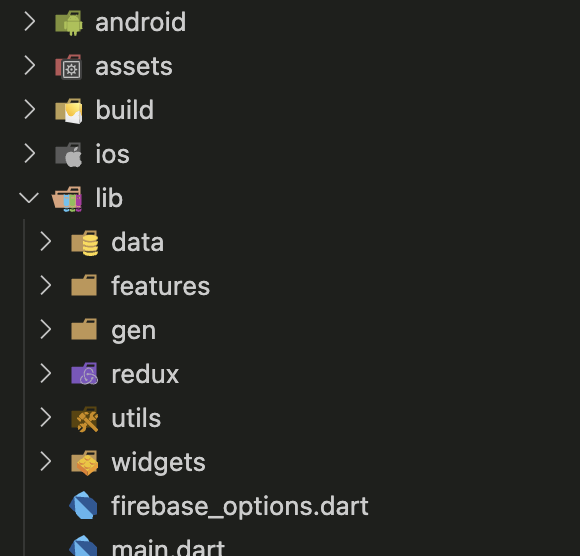
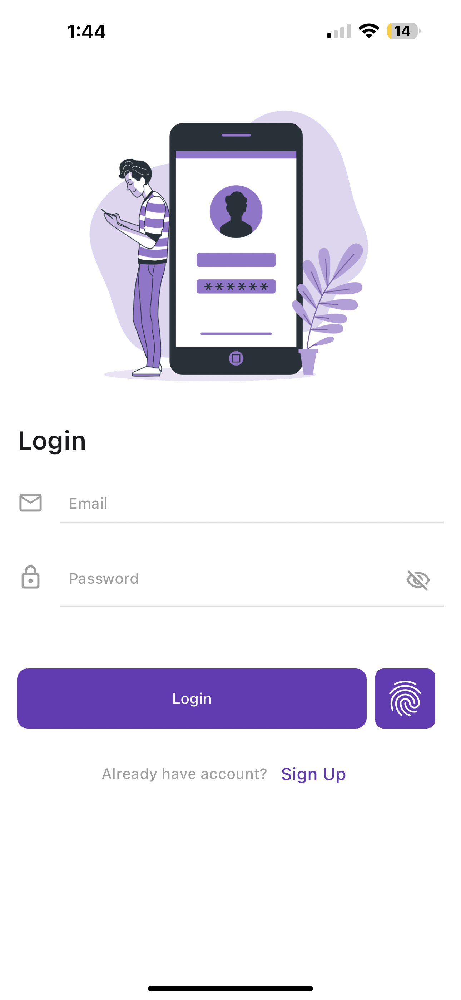
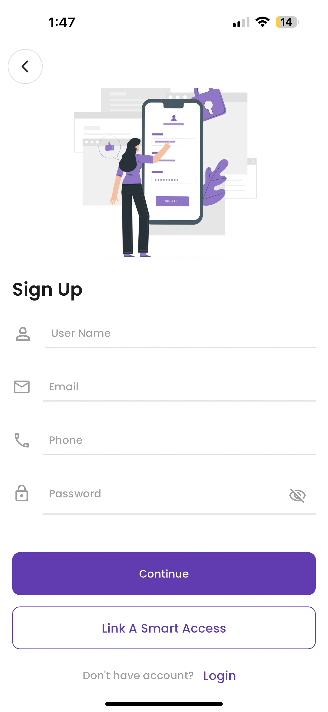
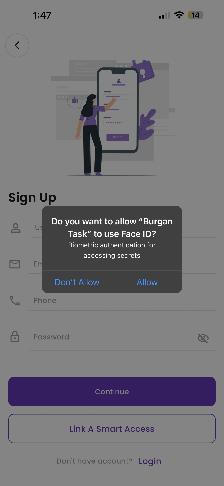
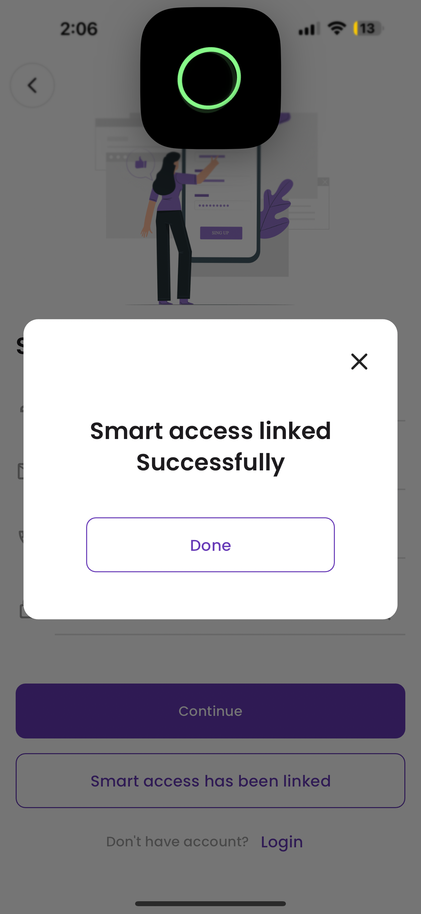
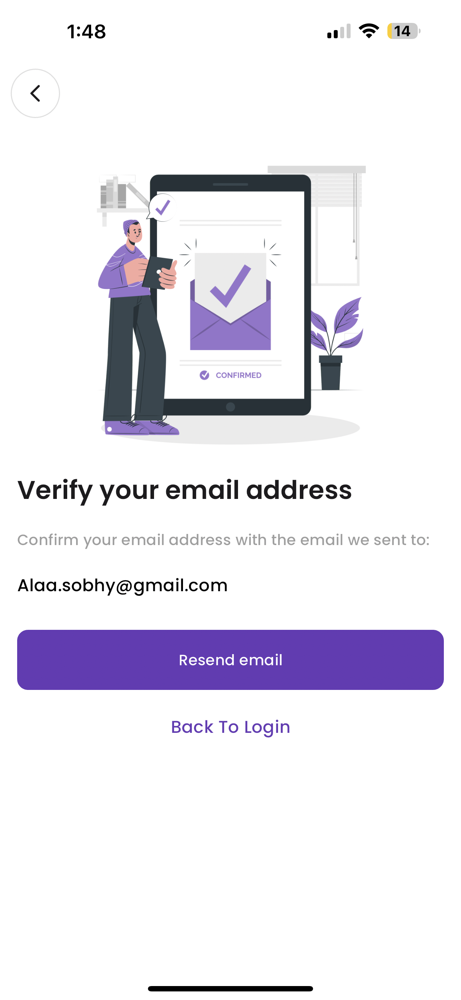
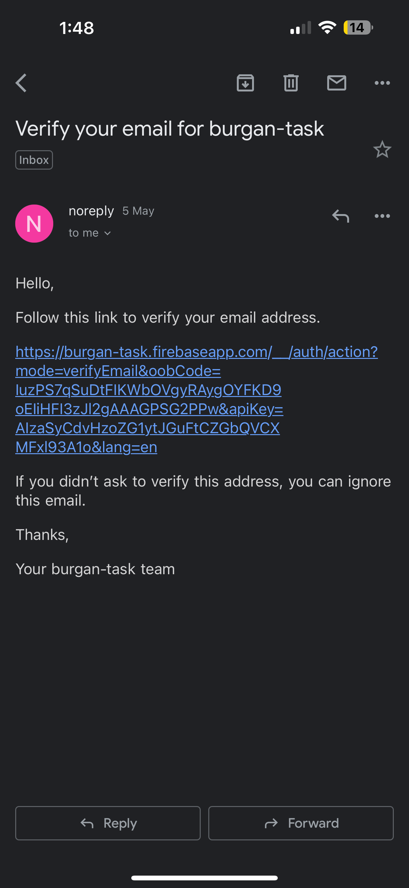
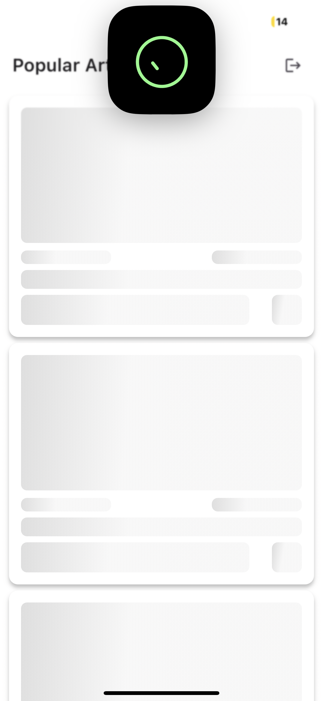

# Burgan Task

A Flutter app designed to provide users with most popular articles on various topics and implement a multi-factor authentication system with support for biometric authentication.
## Features
### The app includes:

1- **Advanced Networking and Data Handling**:

- There was network layer for an application, focusing on error handling using dio, exception management, and request interception/synchronization using dart.
- Here [**Network Handler**](lib/data/network_handler.dart).

##

2- **Secure Authentication and User Management**:

- User can also login with email and password.
- User can also login with biometric (fingerprint, face ID).
- User can sign up with username, email, phone and password and link a smart access.
- User must verify email after account creation to able to login.
- Implement encryption and decryption on user mobile number using RSA.

##

3- **Robust Database Integration and Offline Support**:
 - Utilized the Google News API as a substitute for the New York Times (NYT) API due to subscription constraints.

- Implement an offline-first approach where the app stores articles locally for offline viewing using SQlite.

##

4- **Advanced Ul/UX Design and Development**:
 - Implement and design UI for auth cycle using flutter widgets.
 - Implement and design UI foe articles list and articles details using flutter widgets.


## Dependencies

- **Redux:** State management.
- **dio:** A powerful HTTP networking package for Dart/Flutter.
- **freezed_annotation:** Code generator for data-classes/unions/pattern-matching.
- **retrofit:** A type conversion dio client generator.
- **sqflite:** A SQLite database is a file in the file system identified by a path.
- **connectivity_plus:** Discover network connectivity types that can be used.
- **cached_network_image:** Show images from the internet and keep them in the cache directory.
- **firebase_auth:** Authentication with Firebase.
- **firebase_database:** Store data with Firebase.
- **local_auth:** This includes authentication with biometrics such as fingerprint or facial recognition.- **shared_preferences:** Wraps platform-specific persistent storage for simple data.
- **pointycastle:** A Dart library for encryption and decryption.
- **encrypt:** A set of high-level APIs over PointyCastle for two-way cryptography.
- **google_fonts:** To use fonts from. 
- **flutter_gen:** Code generator for your assets, fonts, colors. 


## Redux State Management
Is an Application State Management framework. In other words, its main objective is to manage a State.


## Project structure

The project based on Redux. It like MVI (Model - View - Intent) structure.




### The app includes:
- data: contains all the data accessing and manipulating components.
- features: contains screens and views.
- redux: contains store, states, actions, middlewares and reducers.
- utils: contains utils classes.

## Screenshots

| Login  | Signup |
| ------------- | ------------- |
|   |   |

| Biometric permession  | Smart access success link |
| ------------- | ------------- |
|   |   |

| Email verification  | Firebase email |
| ------------- | ------------- |
|   |    |

| Articles loading  | Online articles |
| ------------- | ------------- |
|   |   |

| Offline articles  | Article details |
| ------------- | ------------- |
|   |   |

## APK

Here [**APK**](https://drive.google.com/file/d/15kDI5TzQduXO0JvK9K6DqIWojfB2VfeY/view?usp=share_link).

## Video & How to use

Here [**App video**](https://drive.google.com/file/d/1UqqfyWqLyvTn9ZMq9DuyV12SErYF7PXn/view?usp=share_link).

## Installation
1- Clone this repository: 
```bash
https://github.com/AlaaSobhyAbdelhaleem/Burgan-task.git
```
2- Navigate to the project directory:
```bash
cd Burgan-task
```
3- Follow the instructions in this link to install Flutter.

```bash
https://docs.flutter.dev/get-started/install
```

4- Install dependencies:
```bash
flutter pub get
```
5- Run the app on a device or emulator:
```bash
flutter run
```


